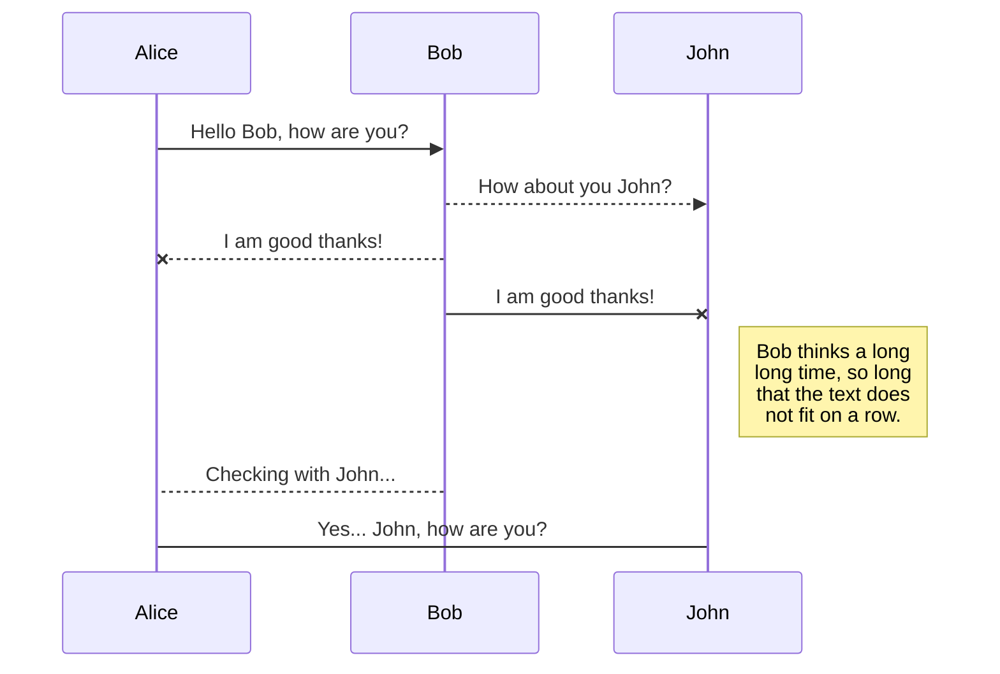
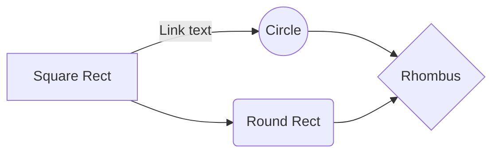

# Welcome to Open Assistant!

Open Assistant or OA for short aims to create an open source voice controlled assistant for use at home or at work. This will make use of neural networks / paths for planning and voice recognition for control.

# Installation

OA is designed to run entirely on the go but a back-end / server might come in the end to help build a network better for more in-depth voice control. It can be setup by downloading a release and running the `.exe` .

## Running from source

To run and build from source you will need to ensure the required modules are installed. This can be done by running `npm i`

# Contributing

Contributing documentation to come soon!

## Diagrams / Workflow / Methodology

Diagrams to come soon!

And this will produce a flow chart:

